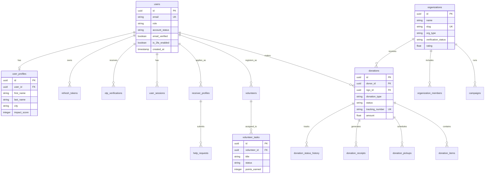

# CharityAI – Database Entity-Relationship Diagram (ERD)

```mermaid
erDiagram
    users ||--o| user_profiles : "has"
    users ||--o{ refresh_tokens : "owns"
    users ||--o{ otp_verifications : "receives"
    users ||--o{ user_sessions : "has"
    users ||--o{ donations : "makes"
    users ||--o{ volunteers : "registers_as"
    users ||--o{ receiver_profiles : "applies_as"

    organizations ||--o{ organization_members : "includes"
    organizations ||--o{ campaigns : "runs"
    organizations ||--o{ donations : "receives"

    donations ||--o{ donation_items : "contains"
    donations ||--o{ donation_pickups : "schedules"
    donations ||--o{ donation_receipts : "generates"
    donations ||--o{ donation_status_history : "tracks"

    volunteers ||--o{ volunteer_tasks : "assigned_to"
    receiver_profiles ||--o{ help_requests : "submits"

    users {
        uuid id PK
        string email UK
        string role
        string account_status
        boolean email_verified
        boolean is_2fa_enabled
        timestamp created_at
    }

    user_profiles {
        uuid id PK
        uuid user_id FK
        string first_name
        string last_name
        string city
        integer impact_score
    }

    organizations {
        uuid id PK
        string name
        string slug UK
        string org_type
        string verification_status
        float rating
    }

    donations {
        uuid id PK
        uuid donor_id FK
        uuid ngo_id FK
        string donation_type
        string status
        string tracking_number UK
        float amount
    }

    volunteer_tasks {
        uuid id PK
        uuid volunteer_id FK
        string title
        string status
        integer points_earned
    }
```
